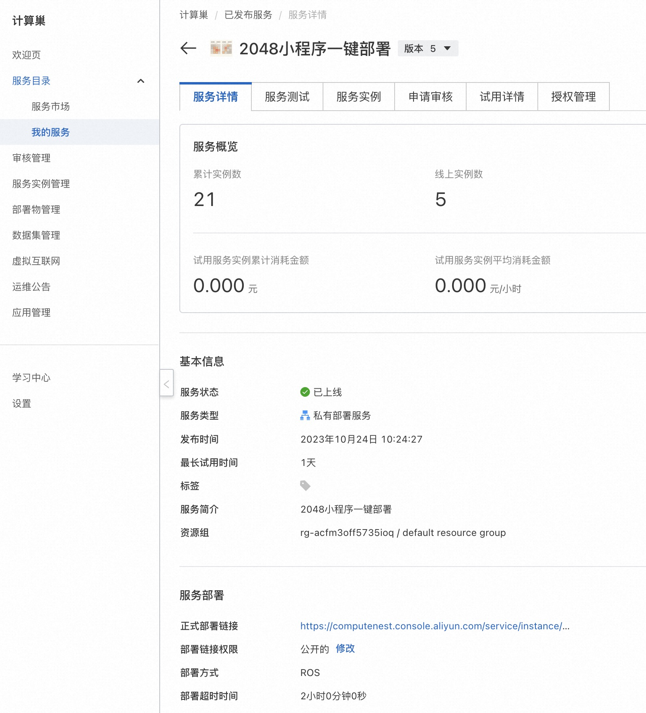
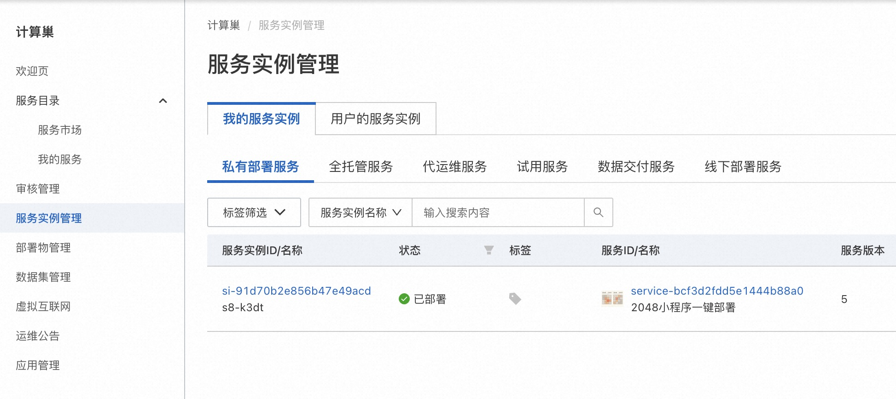
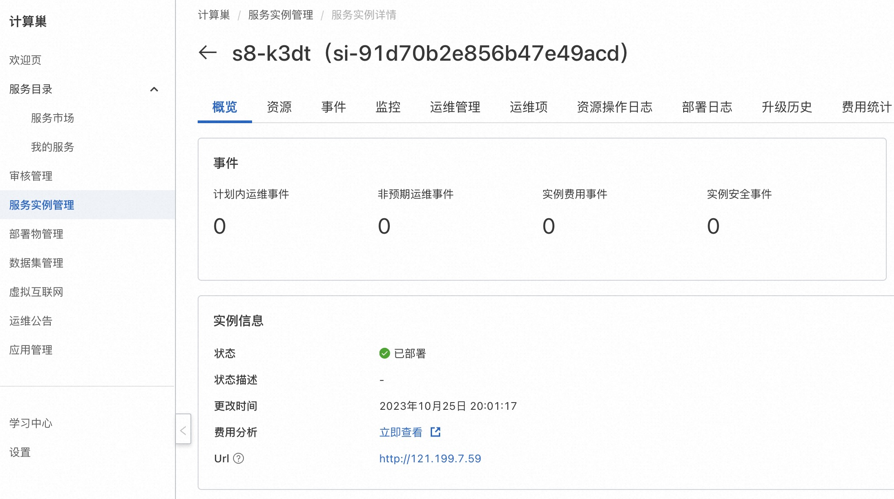

# 服务模版说明文档

## 服务说明

一键部署2048小游戏。

本示例对应的[git地址](https://github.com/aliyun-computenest/2048-demo)

本示例会自动的构建计算巢服务，具体的服务构建流程为

1. 上传文件并构建计算巢文件部署物
2. 创建计算巢服务并关联文件部署物

创建过程大约持续2分钟，当服务变成待提交后构建成功

## 服务架构

本部署架构单机版为单机ecs部署，通过公网ip 80端口访问

## 服务构建计费说明

测试本服务构建无需任何费用，创建服务实例涉及的费用参考服务实例计费说明

## RAM账号所需权限

本服务需要对ECS、VPC等资源进行访问和创建操作，若您使用RAM用户创建服务实例，需要在创建服务实例前，对使用的RAM用户的账号添加相应资源的权限。添加RAM权限的详细操作，请参见[为RAM用户授权](https://help.aliyun.com/document_detail/121945.html)。所需权限如下表所示。

| 权限策略名称                          | 备注                     |
|---------------------------------|------------------------|
| AliyunECSFullAccess             | 管理云服务器服务（ECS）的权限       |
| AliyunVPCFullAccess             | 管理专有网络（VPC）的权限         |
| AliyunROSFullAccess             | 管理资源编排服务（ROS）的权限       |
| AliyunComputeNestUserFullAccess | 管理计算巢服务（ComputeNest）的用户侧权限 |
| AliyunComputeNestSupplierFullAccess | 管理计算巢服务（ComputeNest）的服务商侧权限 |

## 服务实例计费说明

本服务计算巢上的费用主要涉及：

- 所选vCPU与内存规格
- 系统盘类型及容量
- 公网带宽

计费方式包括：

- 按量付费（小时）
- 包年包月

预估费用在创建实例时可实时看到。

目前提供如下实例：

| 规格族           | vCPU与内存 | 系统盘 | 公网带宽 |
|---------------| --- | --- | --- |
| ecs.c6.large  | 内存型c6，2vCPU 4GiB | ESSD云盘 200GiB PL0 | 固定带宽1Mbps |
| ecs.c6.xlarge | 内存型c6，4vCPU 8GiB | ESSD云盘 200GiB PL0 | 固定带宽1Mbps |

## 服务实例部署流程

### 部署参数说明

| 参数组         | 参数项    | 说明                                                                     |
|-------------|--------|------------------------------------------------------------------------|
| 服务实例        | 服务实例名称 | 长度不超过64个字符，必须以英文字母开头，可包含数字、英文字母、短划线（-）和下划线（_） |
|             | 地域     | 服务实例部署的地域                                                              |
| ECS实例配置  | 实例类型   | 可用区下可以使用的实例规格                                                          |
| 网络配置        | 可用区    | ECS实例所在可用区                                                             |

### 部署步骤

1. 部署链接

2. 查看服务实例。服务实例创建成功后，部署时间大约需要1分钟。部署完成后，页面上可以看到对应的服务实例。

3. 通过服务实例访问2048，进入到对应的服务实例后，可以在页面上2048的登录网址。

4. 打开该链接即可游玩2048了。

